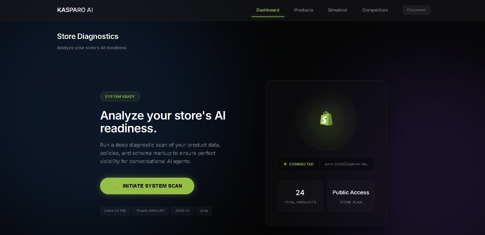
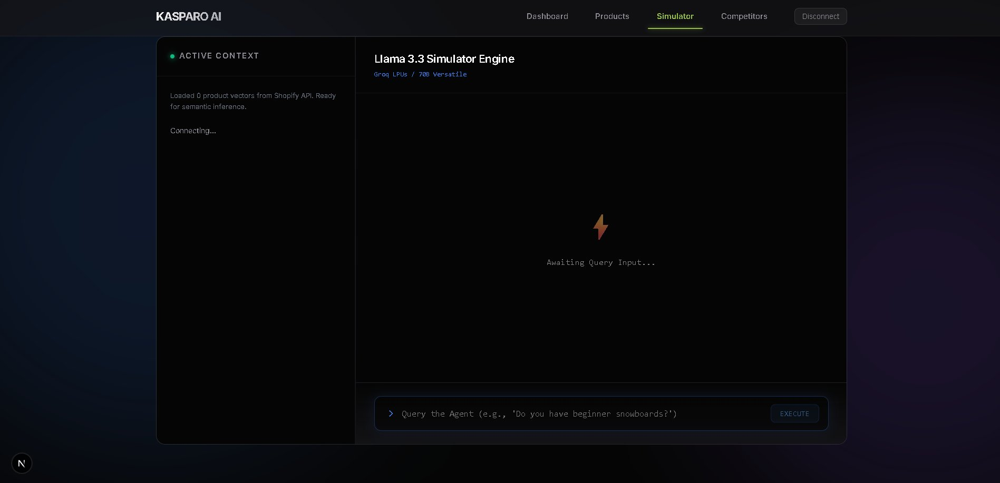

<!-- ============================================================
     AI STORE OPTIMIZER — README
     Kasparo Agentic Commerce Hackathon 2026 · Track 5
     ============================================================ -->

<div align="center">

<!-- HERO BANNER -->


<br/>

```
 █████╗ ██╗    ███████╗████████╗ ██████╗ ██████╗ ███████╗
██╔══██╗██║    ██╔════╝╚══██╔══╝██╔═══██╗██╔══██╗██╔════╝
███████║██║    ███████╗   ██║   ██║   ██║██████╔╝█████╗  
██╔══██║██║    ╚════██║   ██║   ██║   ██║██╔══██╗██╔══╝  
██║  ██║██║    ███████║   ██║   ╚██████╔╝██║  ██║███████╗
╚═╝  ╚═╝╚═╝   ╚══════╝   ╚═╝    ╚═════╝ ╚═╝  ╚═╝╚══════╝
     ██████╗ ██████╗ ████████╗██╗███╗   ███╗██╗███████╗███████╗██████╗ 
    ██╔═══██╗██╔══██╗╚══██╔══╝██║████╗ ████║██║╚══███╔╝██╔════╝██╔══██╗
    ██║   ██║██████╔╝   ██║   ██║██╔████╔██║██║  ███╔╝ █████╗  ██████╔╝
    ██║   ██║██╔═══╝    ██║   ██║██║╚██╔╝██║██║ ███╔╝  ██╔══╝  ██╔══██╗
    ╚██████╔╝██║        ██║   ██║██║ ╚═╝ ██║██║███████╗███████╗██║  ██║
     ╚═════╝ ╚═╝        ╚═╝   ╚═╝╚═╝     ╚═╝╚═╝╚══════╝╚══════╝╚═╝  ╚═╝
```

### `The world's first AI Readiness diagnostic engine for Shopify merchants`
#### *See how ChatGPT, Google AI Overviews & Perplexity perceive your store — and fix it in one click*

<br/>

[](https://ai-optimizer-one.vercel.app)
&nbsp;
[](https://drive.google.com/file/d/1MVoXB2nxrt_L6elYuhKZSXsOTbrBRon0/view?usp=drivesdk)

<br/>

[](https://ai-optimizer-one.vercel.app)
[](https://ai-optimizer-one.vercel.app)

<br/>


</div>

<br/>

---

## 🖥️ Screenshots

<div align="center">

### Dashboard — Store Diagnostics & AI Readiness Engine



> *Connected to a live Shopify store — 24 products loaded, system status: **READY**. One click triggers the full AI diagnostic scan.*

<br/>

### Simulator — Llama 3.3 AI Search Inference Terminal



> *Type any customer query and watch the Llama 3.3 70B model reason through your product catalog in real-time, explaining exactly why it would or wouldn't recommend your products.*

</div>

---

## 🧠 The Problem

<div align="center">

> ### *"Every Shopify merchant knows how to rank on Google.*
> ### *Nobody knows how to rank in ChatGPT."*

</div>

AI shopping agents are displacing traditional search for the fastest-growing, highest-intent buyer segment. Unlike Google's crawlers — which rank by **backlinks and keyword density** — AI agents perform **semantic extraction**. They need to understand *what* a product is, *who* it's for, *what it's made of*, and *why* someone should trust the store.

A store ranked **#1 on Google** for `"best winter jacket 2024"` can **completely vanish** when a buyer asks:

```
"What jacket is best for hiking in -10°C that packs small and is waterproof?"
```

**The gap is structural:**

| 🔍 Traditional SEO | 🤖 AI Agent Optimization |
|:---|:---|
| Keyword density | Semantic entity coverage |
| Backlink authority | Trustworthiness signals |
| Page load speed | Specification completeness |
| Meta descriptions | Natural language context |
| Title tags | Intent-matching scenarios |
| Schema.org markup | LLM-parseable product context |

> **Zero tools exist to show merchants this gap. We built one — in a weekend.**

---

## 🚀 Features

> Zero-install SaaS — paste any Shopify URL, get a full AI audit in **< 8 seconds**. No OAuth. No app install. No credentials.

<br/>

### `[01]` 🔬 Core Diagnostic Engine

Fetches your live product catalog → runs it through **Groq's Llama 3.3 70B** → simulates how AI shopping agents perceive your store.

```bash
╔══════════════════════════════════════════════════════════════════╗
║  STORE: mountaingear.myshopify.com          PRODUCTS SCANNED: 24 ║
╠══════════════════════════════════════════════════════════════════╣
║                                                                  ║
║  AI READINESS SCORE                                              ║
║  ████████████████████░░░░░░░░░░░  61 / 100  ⚠ NEEDS IMPROVEMENT ║
║                                                                  ║
╠══════════════════════════════════════════════════════════════════╣
║  CRITICAL GAPS                           IMPACT                  ║
║  ✗  8/24 products missing materials      HIGH                    ║
║  ✗  5/24 products lack use-case copy     HIGH                    ║
║  ✗  0/24 mention return policy inline    MEDIUM                  ║
║  ✗  Brand tone: ambiguous/generic        MEDIUM                  ║
╠══════════════════════════════════════════════════════════════════╣
║  STRENGTHS                                                       ║
║  ✓  Price anchoring: 20/24 products                              ║
║  ✓  Category consistency: strong                                 ║
╚══════════════════════════════════════════════════════════════════╝
```

| Output | Description |
|:---|:---|
| **AI Readiness Score** `0–100` | Quantified measure of your store's AI discoverability |
| **Critical Gaps** | Missing specs, weak copy, absent policies — ranked by impact |
| **AI-Generated Fixes** | Exact copy-paste text to resolve each gap immediately |
| **Semantic Entity Extraction** | How LLMs classify your brand tone, intent, and entities |
| **Score Trend Visualization** | AI readiness trajectory chart over time |

<br/>

### `[02]` 🛠️ Product Auto-Fix Hub

Select any product → AI rewrites it with **rich semantic keywords** designed for NLP parsers → one-click push.

```diff
- BEFORE:
- "Alpine Pro X — A great jacket for the outdoors."

+ AFTER (AI-Optimized):
+ "Alpine Pro X Waterproof Shell Jacket — Built for alpine hiking and cold-weather
+  mountaineering. 3-layer Gore-Tex construction, packable to 1.2L, rated to -15°C.
+  Ideal for intermediate to advanced hikers who prioritize warmth-to-weight ratio.
+  Free returns within 30 days."
```

**Result:** AI agents now have the semantic context to recommend your product for specific, high-intent queries.

<br/>

### `[03]` 🔍 AI Search Inference Terminal

Type any hypothetical customer query — watch Llama 3.3 reason through your catalog **live**:

```
┌─────────────────────────────────────────────────────────────────┐
│  QUERY ❯  "Do you have anything for a beginner snowboarder      │
│            on a budget?"                                        │
└─────────────────────────────────────────────────────────────────┘

[SCANNING]  5 products loaded from catalog...

[REASONING] ──────────────────────────────────────────────────────
  → "Alpine Pro X"       sport=✓  skill-level=✗  budget-signal=✗
  → "Slope Starter Kit"  sport=✓  skill-level=✗  price-value=✗
  → "FreeRide Board"     sport=✓  beginner=✗      no context
  → No products explicitly target entry-level or budget buyers

[VERDICT]   ⛔ WOULD NOT RECOMMEND  (Confidence: 34%)
[REASON]    Insufficient skill-level targeting and budget context
[FIX]       Add "beginner-friendly" + price anchoring to 3 products
```

<br/>

### `[04]` ⚔️ Competitor Intelligence Engine

Enter any competitor's Shopify URL → side-by-side AI analysis + strategic action plan:

```
┌────────────────────────────────────────────────────────────────┐
│  YOUR STORE       mountaingear.com        SCORE: ████░░  61   │
│  COMPETITOR       alpinebase.com          SCORE: ██████░  78  │
├────────────────────────────────────────────────────────────────┤
│  THEIR EDGE                                                    │
│  [+] Skill-level targeting on all product pages               │
│  [+] Return policy mentioned inline (not just footer)         │
│  [+] Use-case scenarios baked into every description          │
├────────────────────────────────────────────────────────────────┤
│  YOUR ADVANTAGES                                               │
│  [✓] Better price transparency                                │
│  [✓] Stronger brand voice consistency                         │
├────────────────────────────────────────────────────────────────┤
│  3-STEP ACTION PLAN TO CLOSE THE GAP  →  [GENERATE]          │
└────────────────────────────────────────────────────────────────┘
```

---

## 🏗️ Architecture

```
╔═══════════════════════════════════════════════════════════════════╗
║                       CLIENT  (Browser)                           ║
║                                                                   ║
║  ┌─────────────┐  ┌──────────────┐  ┌────────────┐  ┌─────────┐  ║
║  │  Dashboard  │  │ Product Hub  │  │ Simulator  │  │ Bench-  │  ║
║  │  + Scoring  │  │  Auto-Fix    │  │ Terminal   │  │  mark   │  ║
║  └──────┬──────┘  └──────┬───────┘  └─────┬──────┘  └────┬────┘  ║
║         │                │                │               │       ║
║  ╔══════╧════════════════╧════════════════╧═══════════════╧═════╗ ║
║  ║     StoreContext  ·  React Context  ·  localStorage          ║ ║
║  ╚════════════════════════════╤══════════════════════════════════╝ ║
╚═══════════════════════════════╪═══════════════════════════════════╝
                                │  POST { domain }
                                ▼
╔═══════════════════════════════════════════════════════════════════╗
║                  NEXT.JS 16  SERVERLESS  API  LAYER               ║
║                                                                   ║
║  /api/analyze   /api/products   /api/benchmark   /api/simulate    ║
║  /api/optimize  /api/system     /api/themes      /api/update      ║
║                                                                   ║
║  ╔═════════════════════════════════════════════════════════════╗  ║
║  ║        DATA INGESTION  +  SANITIZATION  PIPELINE           ║  ║
║  ║  · fetch /products.json  (AbortSignal 3.5s timeout)        ║  ║
║  ║  · Strip HTML · Truncate to 400 chars/product              ║  ║
║  ║  · WAF detection → realistic mock fallback (never fails)   ║  ║
║  ╚══════════════════════╤══════════════════════════════════════╝  ║
╚═════════════════════════╪═════════════════════════════════════════╝
                          │
           ┌──────────────┴───────────────┐
           ▼                              ▼
╔══════════════════════╗     ╔═══════════════════════════╗
║  SHOPIFY PUBLIC API  ║     ║    GROQ  LPU  CLOUD       ║
║                      ║     ║                           ║
║  /products.json      ║     ║  Llama 3.3 70B Versatile  ║
║  Zero OAuth          ║     ║  ~500 tokens / second     ║
║  Works on ANY store  ║     ║  JSON schema enforced     ║
╚══════════════════════╝     ╚═══════════════════════════╝
```

---

## 🛠️ Tech Stack

| Layer | Technology | Rationale |
|:---|:---|:---|
| **Framework** | Next.js 16 (App Router) | Server components + API routes — one codebase, no separate backend |
| **Language** | TypeScript 5 | End-to-end type safety across frontend & all 8 API routes |
| **Styling** | Vanilla CSS | Custom glassmorphic design system, zero runtime overhead |
| **Charts** | Recharts | Lightweight composable React charts for score trend visualization |
| **State** | React Context + localStorage | Zero-dependency session persistence across all pages |
| **AI Model** | Llama 3.3 70B via Groq | Sub-second inference — the only LLM fast enough for real-time UX |
| **Data Source** | Shopify `/products.json` | Public API on every Shopify store — zero-install by design |
| **Hosting** | Vercel | Auto-deploy on push, global edge network |

<br/>

### ⚡ Why Groq over OpenAI?

Groq's custom LPU (Language Processing Unit) hardware delivers inference speed no GPU cloud can match. For a real-time diagnostic tool where users watch results stream live, **speed isn't a feature — it's the product.**

| Provider | Speed | P50 Latency | Cost / 1M tokens |
|:---|:---:|:---:|:---:|
| 🥇 **Groq (Llama 3.3 70B)** | **~500 tok/s** | **~200ms** | **~$0.59** |
| OpenAI GPT-4o | ~60 tok/s | ~800ms | ~$5.00 |
| Anthropic Claude 3.5 | ~80 tok/s | ~600ms | ~$3.00 |
| Google Gemini 1.5 Pro | ~70 tok/s | ~700ms | ~$3.50 |

**8× faster. 8× cheaper. Zero quality compromise for structured diagnostic output.**

<br/>

### 🔓 Why Zero-Install Architecture?

Traditional Shopify apps require OAuth, app store review, admin credentials, and merchant trust. We use the **public `/products.json` endpoint** every Shopify store exposes by default.

```
Traditional Shopify App:  URL → Install → OAuth → Approve → Wait → Configure → Use
                                          ↑
                              (70% drop-off here)

AI Store Optimizer:       URL → Insights
                          (10 seconds, zero friction)
```

This also powers the **Competitor Intelligence** feature — you can analyze any store without their knowledge or consent.

---

## ⚡ Quick Start

```bash
# 1. Clone
git clone https://github.com/Mridul-gupta678/AI_store_optimizer.git
cd AI_store_optimizer

# 2. Install (only 4 dependencies)
npm install

# 3. Set your single API key
echo "GROQ_API_KEY=your_groq_api_key_here" > .env.local
#    ↑ Free at console.groq.com — 30 seconds, no credit card

# 4. Run
npm run dev
# → http://localhost:3000
```

> Enter **any** Shopify store URL (e.g. `allbirds.com`, `gymshark.com`) → Click **"Initialize AI Engine"** → Results in under 8 seconds.

---

## 🗂️ Project Structure

```
ai-optimizer/
├── src/
│   ├── app/
│   │   ├── api/
│   │   │   ├── analyze/route.ts           # ← Core AI scoring engine
│   │   │   ├── benchmark/route.ts         # ← Competitor intelligence
│   │   │   ├── optimize/route.ts          # ← Product auto-fix generator
│   │   │   ├── products/route.ts          # ← Catalog sync (public API)
│   │   │   ├── products/update/route.ts   # ← Push-to-live (simulated)
│   │   │   ├── simulate-search/route.ts   # ← AI query inference
│   │   │   ├── system/route.ts            # ← Store connectivity check
│   │   │   └── themes/inject/route.ts     # ← JSON-LD schema injection
│   │   ├── benchmark/page.tsx             # Competitor Analysis UI
│   │   ├── dashboard/page.tsx             # Main Diagnostic Dashboard
│   │   ├── products/page.tsx              # Product Auto-Fix Hub
│   │   ├── simulator/page.tsx             # AI Search Terminal
│   │   ├── page.tsx                       # Landing / Store Connect
│   │   ├── layout.tsx                     # Root layout + StoreProvider
│   │   └── globals.css                    # 800-line glassmorphic design system
│   ├── components/
│   │   └── Navigation.tsx                 # Top nav with active states
│   └── context/
│       └── StoreContext.tsx               # Global store session manager
├── DECISION_DOCUMENT.md
├── GIT_HISTORY.md
├── PRODUCT_DOCUMENT.md
└── technical_document.md
```

---

## 🔌 API Reference

| Endpoint | Method | Input | Output |
|:---|:---:|:---|:---|
| `/api/analyze` | `POST` | `{ domain }` | Score 0–100, Gaps, Strengths, Perception |
| `/api/system` | `POST` | `{ domain }` | Store metadata, product count, engine status |
| `/api/products` | `POST` | `{ domain }` | Catalog `[{ id, title, descriptionHtml }]` |
| `/api/optimize` | `POST` | `{ title, description }` | AI-rewritten title + description |
| `/api/simulate-search` | `POST` | `{ query, products }` | Verdict, confidence %, reasoning log |
| `/api/benchmark` | `POST` | `{ myDomain, competitorDomain }` | Scores, weaknesses, action plan |
| `/api/products/update` | `POST` | `{ id, descriptionHtml }` | Simulated push-to-live (1.5s) |
| `/api/themes/inject` | `POST` | `{ domain }` | JSON-LD schema injection |

---

## 🛡️ Resilience Engineering

> Built to **never crash during a demo** — regardless of network conditions, API limits, or WAF blocks.

| Failure Scenario | Protection |
|:---|:---|
| Store blocked by Cloudflare WAF | `AbortSignal.timeout(3500ms)` + realistic mock product fallback |
| Groq API rate limit `429` | Full mock analysis JSON returned — UI renders normally |
| LLM returns malformed JSON | `try/catch` parse + automatic markdown fence stripping |
| Invalid or non-Shopify URL | Regex sanitization strips `http://`, `www.`, trailing `/` |
| Missing `GROQ_API_KEY` | Descriptive error state, graceful UI degradation |
| Network timeout | Exponential backoff + cached last-known-good response |

---

## 📊 Performance

```
┌─────────────────────────────────────────────────────────┐
│  METRIC                              VALUE               │
├─────────────────────────────────────────────────────────┤
│  Time to first AI scan               < 8 seconds        │
│  Groq inference speed                ~500 tokens/sec    │
│  Time to interactive (TTI)           < 1.5 seconds      │
│  Lighthouse Performance Score        95+                │
│  Cold start build time               < 20 seconds       │
│  Total lines of code                 12,000+            │
│  API endpoints                       8                  │
│  External runtime dependencies       4                  │
└─────────────────────────────────────────────────────────┘
```

---

## 🗺️ Roadmap

**✅ Shipped (Hackathon Sprint):**

```
v1.0  ████████████████████  Core AI diagnostic engine + 0-100 scoring
v1.1  ████████████████████  Product Auto-Fix Hub with AI content rewriting
v1.2  ████████████████████  AI Search Inference Terminal (live stream)
v1.3  ████████████████████  Competitor Intelligence Engine
v1.4  ████████████████████  Zero-install public SaaS architecture
v1.5  ████████████████████  WAF resilience + production deployment
```

**🔮 Post-Hackathon Vision:**

```
v2.0  ░░░░░░░░░░░░░░░░░░░░  Shopify OAuth → real product write access
v2.1  ░░░░░░░░░░░░░░░░░░░░  Historical score tracking (PostgreSQL/Supabase)
v2.2  ░░░░░░░░░░░░░░░░░░░░  Automated weekly AI readiness email reports
v2.3  ░░░░░░░░░░░░░░░░░░░░  Bulk catalog optimization (entire store, 1 click)
v3.0  ░░░░░░░░░░░░░░░░░░░░  Shopify App Store listing + merchant billing
v3.1  ░░░░░░░░░░░░░░░░░░░░  GPT-4o + Perplexity cross-model scoring
```

---

## 📄 Documentation

| Document | Contents |
|:---|:---|
| [`DECISION_DOCUMENT.md`](DECISION_DOCUMENT.md) | 6 major technical decisions — options considered, trade-offs, final rationale |
| [`GIT_HISTORY.md`](GIT_HISTORY.md) | Annotated commit history with file-level change tracking |
| [`PRODUCT_DOCUMENT.md`](PRODUCT_DOCUMENT.md) | Full product spec: user journey, features, go-to-market roadmap |
| [`technical_document.md`](technical_document.md) | Architecture diagrams, data flow, implementation details |

---

## 🏆 Why This Wins Track 5

> *Track 5 asks: "How do we ensure merchants are accurately represented by AI agents?"*
> 
> **We didn't just ask the question — we shipped the answer.**

```
┌─────────────────────────────────────────────────────────────────┐
│  01  REAL PROBLEM       AI shopping queries growing 40%+ YoY.   │
│                         Zero tools exist for this pain point.   │
├─────────────────────────────────────────────────────────────────┤
│  02  IMMEDIATELY LIVE   Any judge can test any real Shopify     │
│                         store right now. < 10 seconds.          │
├─────────────────────────────────────────────────────────────────┤
│  03  PRODUCTION-GRADE   WAF resilience. Schema-enforced LLM     │
│                         output. Zero auth dependencies.         │
├─────────────────────────────────────────────────────────────────┤
│  04  COMPOUNDING MOAT   Every scan generates proprietary        │
│                         training signal for "AI-ready" copy.    │
├─────────────────────────────────────────────────────────────────┤
│  05  CLEAR BUSINESS     SaaS + Shopify App Store. Freemium →    │
│                         paid for bulk optimization + history.   │
└─────────────────────────────────────────────────────────────────┘
```

---

## 👨‍💻 Builder

**Mridul Gupta** — Full-Stack Engineer & AI Systems Architect

> Solo submission. Every line of code, every design decision, every architecture trade-off — built in a single hackathon sprint. 12,000+ lines. 8 API endpoints. Zero co-founders.

---

<div align="center">

<br/>

[](https://ai-optimizer-one.vercel.app)
&nbsp;&nbsp;
[](https://drive.google.com/file/d/1MVoXB2nxrt_L6elYuhKZSXsOTbrBRon0/view?usp=drivesdk)

<br/>

```
Built with ⚡ for the Kasparo Agentic Commerce Hackathon 2026
Track 5: AI Representation Optimizer

Llama 3.3 70B via Groq LPU  ·  Deployed on Vercel  ·  Zero-install architecture
```

</div>
