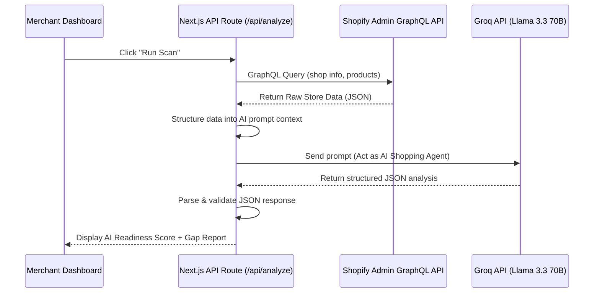
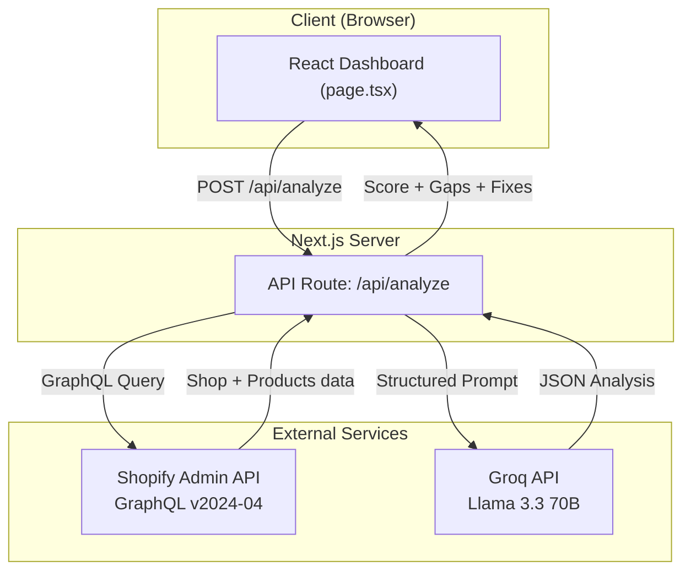

# Technical Document - AI Representation Optimizer

## 1. System Architecture
**Overview:** A Next.js 16 (App Router) application serving as both the frontend dashboard and secure backend orchestration layer. The app connects to real Shopify stores via the Admin GraphQL API and uses Groq-hosted Llama 3.3 70B for AI-powered diagnostic analysis.

**Why Next.js?** It provides a seamless way to combine secure API integrations (Shopify & Groq) in server-side `/api` routes with a highly responsive React frontend, avoiding CORS issues and keeping API keys completely hidden from the client. We explicitly used Vanilla CSS (no Tailwind) to build a custom, high-end SaaS design system.

**Why Groq + Llama 3.3 70B?** We initially planned to use Google Gemini, but encountered persistent quota restrictions on the free tier. We pivoted to Groq which provides blazing-fast inference (sub-second responses) on the open-source Llama 3.3 70B model, with a generous free tier of 30 requests/minute. This decision is documented in our thinking log.

### Data Flow Diagram


### Architecture Diagram


## 2. Core Logic & Implementation Details

### Data Ingestion Engine
- **Endpoint:** Shopify Admin GraphQL API (v2024-04)
- **Authentication:** Custom app with `X-Shopify-Access-Token` header using an Admin API access token (`shpat_*`)
- **Data Fetched:** Store name, store description, and up to 5 active products (title, HTML description, status)
- **Why GraphQL over REST:** Single request fetches all needed data vs. multiple REST calls, reducing latency

### AI Perception Engine
- **Model:** Llama 3.3 70B via Groq's OpenAI-compatible API
- **Prompt Strategy:** We don't ask the LLM to "summarize." We instruct it to role-play as an autonomous AI shopping agent evaluating the store for trust, clarity, and completeness. The system prompt enforces a strict JSON schema response.
- **Temperature:** Set to 0.3 for consistent, deterministic analysis across repeated scans
- **Response Format:** Forced structured JSON with: score (0-100), overall perception, critical gaps (with impact level + suggested fix), and optimized areas

### Prompt Engineering Details
The prompt explicitly asks the LLM to:
1. Identify missing information that would block AI recommendations
2. Flag contradictory or ambiguous data
3. Evaluate trust signals (policies, descriptions, completeness)
4. Provide actionable suggested fixes with exact text merchants can paste

## 3. Explicit Failure & Error Handling

We prioritize robustness over "happy-path" scenarios.

| Failure Scenario | How We Handle It |
|---|---|
| **Missing API credentials** | Server returns 500 with descriptive message; UI shows clear error |
| **Shopify API returns errors** | Server logs exact GraphQL errors; UI shows "Check scopes and token" |
| **Groq API key invalid** | Server returns 500; UI shows "Check Groq API key" |
| **LLM returns malformed JSON** | `JSON.parse` wrapped in try/catch; response cleaned of markdown code blocks before parsing |
| **LLM returns unexpected schema** | Frontend gracefully handles missing fields with optional chaining and fallback values |
| **Network timeout** | Standard fetch timeout; catch block returns generic error to UI |

**Key design choice:** We strip markdown code fences (` ```json `) from LLM responses before parsing, because even with strict "no markdown" instructions, LLMs occasionally wrap JSON in code blocks.

## 4. Limitations & Future Improvements

| Current Limitation | Planned Improvement |
|---|---|
| Analysis limited to shop info + 5 products | Expand to full catalog, collections, and metafields |
| Store policies not accessible via current API scopes | Add `read_shopify_payments` scope to access refund/shipping policies |
| Single-scan snapshot model | Implement scheduled scans with historical score tracking |
| Text-only analysis | Incorporate vision models to analyze product image quality |
| No authentication for the dashboard | Add Shopify App Bridge OAuth for production deployment |
| English-only analysis | Add multi-language support for international stores |
